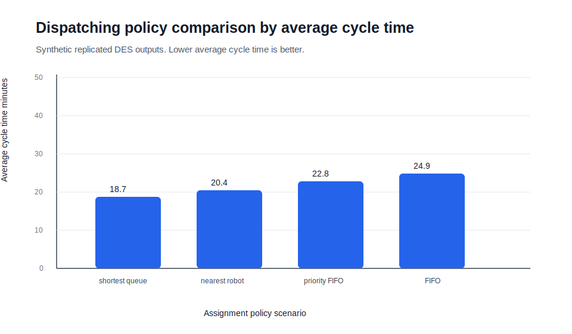
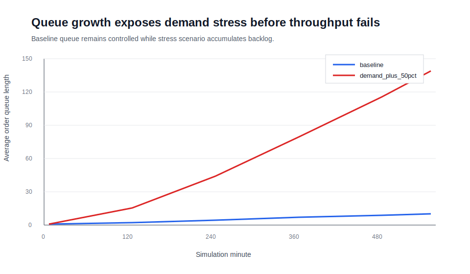

# Robotic Warehouse Discrete-Event Simulation

**A public-safe, professional simulation and digital-twin project for robotic warehouse systems, fleet sizing, dispatching policy comparison, capacity planning, and operational decision support.**

This project implements a reproducible **discrete-event simulation (DES)** of a simplified robotic warehouse using **Python, SimPy, pandas, matplotlib, and Streamlit**. It now includes grid-based warehouse layout, travel-distance calculation, task-assignment policies, congestion-aware travel time, charging-station constraints, calibration hooks, and historical KPI validation patterns.

The project does **not** use private employer data or proprietary warehouse parameters. All assumptions are synthetic and documented.

---

## Executive Summary

Robotic warehouse changes are expensive to test physically. A simulation lets teams evaluate operational changes before rollout: adding robots, changing station capacity, adding chargers, increasing demand, improving reliability, or modifying dispatch rules.

This project is built as a modeling deliverable that a senior data scientist could discuss with robotics, software, operations, and executive stakeholders. It answers practical questions:

- How much throughput is gained by adding robots?
- Where does throughput plateau because another resource becomes constrained?
- How does demand growth affect cycle time and SLA attainment?
- How do charging-station constraints change system behavior?
- Which task-assignment rule performs better under the same demand pattern?
- How can synthetic or Kaggle-style event data calibrate simulation assumptions?
- How far are simulated KPIs from historical operating KPI targets?

---

## Current Capabilities

| Area | Implementation |
|---|---|
| Simulation engine | SimPy-based DES with order arrivals, robot workers, stations, chargers, failures, queue monitoring, and event records |
| Layout model | Synthetic grid warehouse with storage cells, stations, chargers, inbound and outbound points |
| Travel model | Manhattan travel distance converted to time with congestion multiplier |
| Dispatching policies | FIFO, priority FIFO, nearest robot, and shortest-queue-priority baselines |
| Charging constraints | Charging stations modeled as constrained resources with wait time and utilization |
| Calibration | Helpers to estimate arrival rate and service-time assumptions from event logs |
| Historical KPI validation | Simulated-vs-historical KPI error table for reviewable model validation |
| Digital twin UI | Streamlit dashboard for interactive scenario planning |
| Engineering hygiene | Package structure, `pyproject.toml`, tests, ruff linting, GitHub Actions CI |
| Communication | Executive summary, result charts, notebook, model design, validation plan, and experiment protocol |

---

## Repository Structure

```text
robotic-warehouse-simpy-simulation/
├── README.md
├── pyproject.toml
├── requirements.txt
├── app/
│   └── streamlit_app.py
├── data/
│   └── sample/
│       ├── historical_kpis.csv
│       └── kaggle_style_event_log.csv
├── docs/
│   ├── digital_twin_enhancements.md
│   ├── experiment_protocol.md
│   ├── model_design.md
│   └── validation_plan.md
├── notebooks/
│   └── 01_simulation_scenario_analysis.ipynb
├── reports/
│   ├── executive_summary.md
│   ├── scenario_summary.csv
│   ├── fleet_size_sweep.csv
│   ├── demand_stress_test.csv
│   ├── dispatch_policy_comparison.csv
│   ├── historical_kpi_validation_error.csv
│   └── figures/
│       ├── throughput_by_fleet_size.svg
│       ├── cycle_time_by_demand.svg
│       ├── sla_attainment_by_scenario.svg
│       ├── dispatch_policy_comparison.svg
│       └── queue_length_time_series.svg
├── src/
│   └── warehouse_sim/
│       ├── __init__.py
│       ├── calibration.py
│       ├── config.py
│       ├── entities.py
│       ├── experiments.py
│       ├── layout.py
│       ├── policies.py
│       └── simulation.py
└── tests/
    ├── test_calibration.py
    ├── test_config.py
    ├── test_experiments.py
    ├── test_layout_and_policies.py
    └── test_simulation.py
```

---

## Model Scope

The current model represents a simplified goods-to-person robotic warehouse.

### Entities

- **Orders** arrive stochastically and enter a shared queue.
- **Robots** pull work from the queue and perform travel, service, drop-off, failure recovery, and charging.
- **Stations** represent constrained pick/drop resources.
- **Chargers** represent constrained charging capacity.
- **Grid layout** represents public-safe storage, station, charger, inbound, and outbound locations.
- **Monitor records** capture time-series queue, station, and charger state.
- **Order records** capture cycle time, waits, travel distance, service components, failure, charging, priority, and SLA status.

### Dispatching Policies

| Policy | Purpose |
|---|---|
| `fifo` | Baseline first-in-first-out assignment |
| `priority_fifo` | Urgent work first, then FIFO |
| `nearest_robot` | Distance-aware assignment based on robot location |
| `shortest_queue_priority` | Priority and queue-pressure-aware baseline |

### KPI Outputs

| KPI | Why it matters |
|---|---|
| Throughput per hour | Capacity and productivity |
| Average / P50 / P90 cycle time | Latency and tail-risk |
| Queue wait | Robot/task assignment pressure |
| Station wait | Station capacity pressure |
| Charging wait | Charger bottleneck risk |
| Travel distance | Layout and routing efficiency |
| Robot utilization | Fleet sizing and saturation |
| Station utilization | Shared-resource saturation |
| Charger utilization | Charging infrastructure saturation |
| SLA attainment | Service-level risk |
| Bottleneck classification | Executive interpretation |

---

## Result Preview

### Throughput vs Fleet Size


### Cycle Time Under Demand Stress


### SLA Attainment by Scenario


### Dispatching Policy Comparison



### Queue Length Over Time



---

## How to Run

```bash
git clone https://github.com/aamer-javed/data-science-portfolio.git
cd data-science-portfolio/projects/robotic-warehouse-simpy-simulation

python -m venv .venv
source .venv/bin/activate  # Windows: .venv\Scripts\activate

pip install -r requirements.txt
```

Run tests and linting:

```bash
pytest
ruff check src tests
```

Run the base simulation:

```bash
python -m warehouse_sim.simulation
```

Regenerate reports and charts:

```bash
python -m warehouse_sim.experiments
```

Open the notebook:

```bash
jupyter notebook notebooks/01_simulation_scenario_analysis.ipynb
```

Run the digital twin dashboard:

```bash
streamlit run app/streamlit_app.py
```

---

## Calibration and KPI Validation

The sample event log in `data/sample/kaggle_style_event_log.csv` demonstrates how public or Kaggle-style warehouse data can be used to estimate simulation inputs.

The sample KPI file in `data/sample/historical_kpis.csv` demonstrates how simulated outputs can be compared against historical operating targets.

This is the professional workflow:

1. Fit arrival and service-time assumptions from event logs.
2. Run replicated scenarios.
3. Compare simulated throughput, latency, and SLA metrics to historical targets.
4. Review error and adjust assumptions or model scope.
5. Version the scenario and publish an executive recommendation.

---

## Example Interpretation

A typical result pattern is:

1. **Baseline** establishes the reference operating point.
2. **Fleet-size sweep** shows whether adding robots improves throughput or shifts congestion to stations.
3. **Demand stress test** identifies the arrival rate where cycle time and SLA attainment degrade.
4. **Charging-constrained scenario** quantifies charger wait and charger utilization risk.
5. **Dispatching-policy comparison** shows whether priority-aware or distance-aware assignment improves cycle time.
6. **KPI validation** compares simulated values against historical KPI targets.

Example recommendation style:

> The model suggests that adding robots improves throughput only until another shared resource becomes limiting. Once station, charger, or congestion effects rise, additional robots alone have diminishing returns. The next scenario set should evaluate combined fleet sizing, station capacity, charging infrastructure, reliability improvement, and dispatch-policy changes before physical rollout.

---

## Documentation

- [Model design](docs/model_design.md)
- [Digital twin enhancements](docs/digital_twin_enhancements.md)
- [Validation plan](docs/validation_plan.md)
- [Experiment protocol](docs/experiment_protocol.md)
- [Executive summary](reports/executive_summary.md)

---

## Production Upgrade Path

For a production-grade digital twin, next steps would include:

- Calibrate distributions by site, zone, shift, SKU class, and robot generation.
- Replace Manhattan distance with a warehouse graph and restricted paths.
- Add blocked aisles, traffic rules, and congestion spillback.
- Compare dispatching policies against historical production dispatch decisions.
- Add experiment tracking with MLflow or a database-backed scenario registry.
- Surface results through Tableau, Streamlit, Grafana, or a simulation service API.

---

## Skills Demonstrated

**Simulation:** DES, stochastic systems, queueing, replications, sensitivity analysis  
**Data Science:** calibration, experimental design, KPI validation, interpretation  
**Operations Research:** capacity planning, bottleneck analysis, fleet sizing, utilization trade-offs  
**Robotics/Fleet Ops:** grid travel, assignment policy, chargers, station constraints, priority work  
**Engineering:** Python package structure, tests, CI, reproducible experiment runner, Streamlit app  
**Communication:** executive summary, charts, scenario recommendations, model limitations  

---

## Disclaimer

This is a public portfolio project using synthetic assumptions and generated outputs. It does not contain confidential employer data, operational parameters, internal layouts, production algorithms, or proprietary system behavior.
