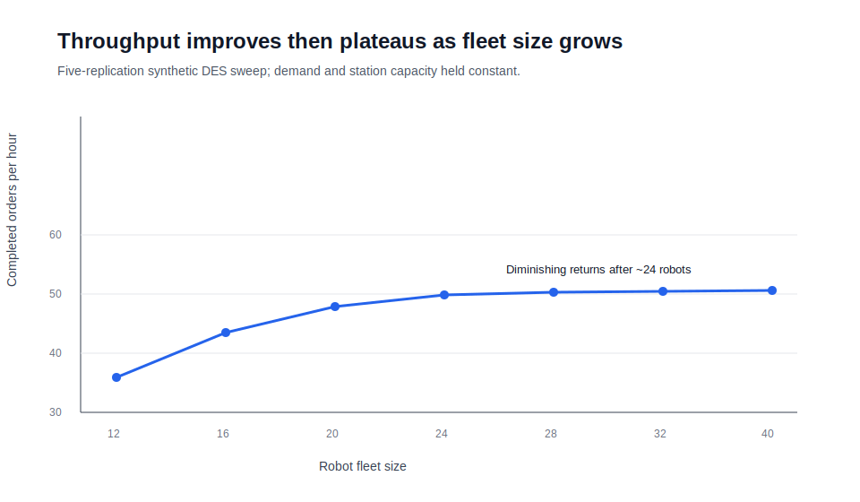
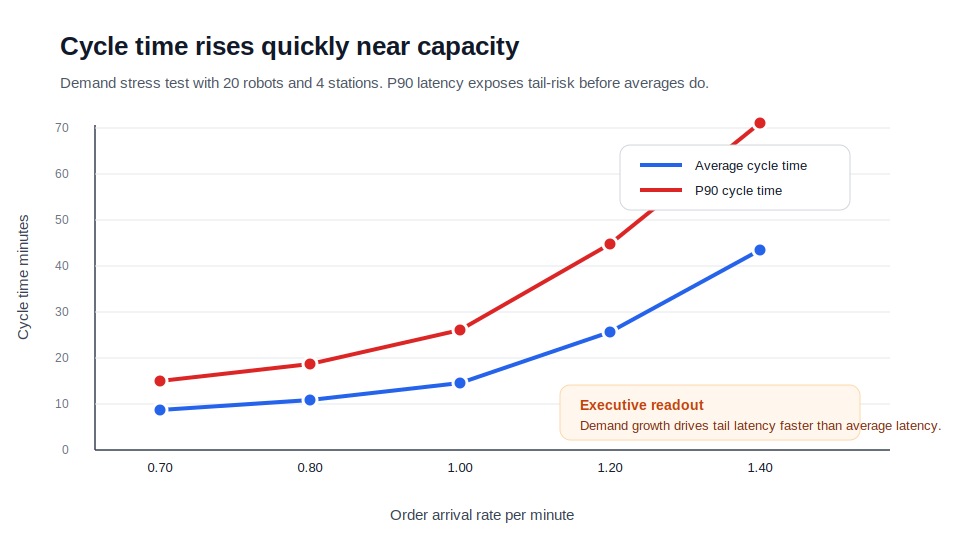
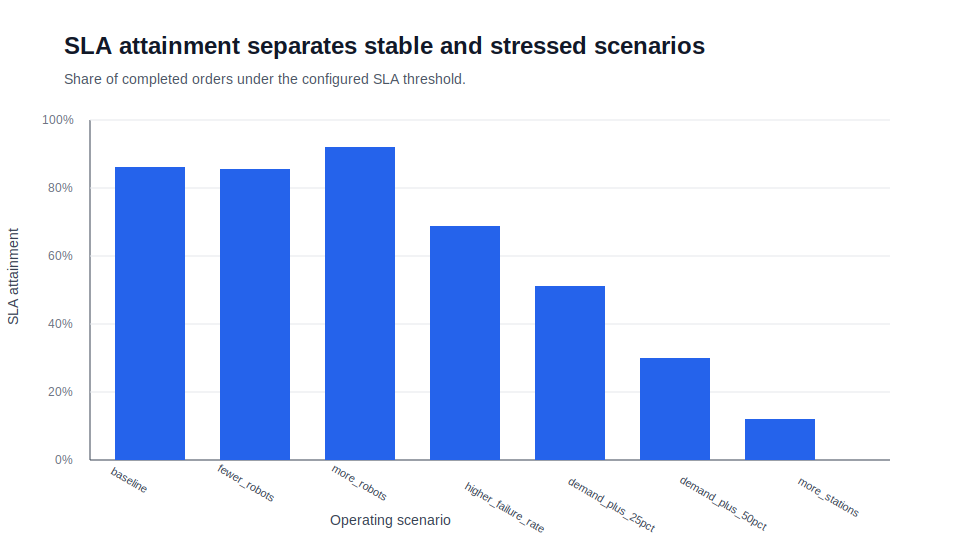

# Robotic Warehouse Discrete-Event Simulation

**Portfolio project for senior/principal data science roles in robotic warehouse simulation, fleet optimization, operations research, and digital twins.**

This project builds a Python/SimPy discrete-event simulation of a robotic warehouse system. The model represents stochastic order arrivals, a constrained robot fleet, pick/drop station capacity, travel time, service time, robot failures, charging delays, queueing behavior, and throughput bottlenecks.

## Executive Summary

Robotic warehouse changes are expensive to test directly in production. This simulation creates a safe environment to evaluate demand growth, fleet sizing, station capacity, charging, and downtime before making operational or product decisions.

The current simulation demonstrates three decision-support patterns:

1. **Fleet sizing:** Throughput improves as robots are added, but returns eventually flatten when station capacity becomes the bottleneck.
2. **Demand stress testing:** Average and P90 cycle time increase sharply as order arrival rate approaches system capacity.
3. **Operational tradeoffs:** The model compares throughput, SLA attainment, cycle time, robot utilization, and station utilization across scenarios.

## Business Questions Answered

- How many orders per hour can the warehouse process under the current configuration?
- When demand increases, where does the system degrade first?
- Does adding more robots improve throughput or only create downstream congestion?
- Are pick/drop stations becoming the true bottleneck?
- Which operating scenarios preserve SLA performance?

## Result Screenshots

### Throughput vs Fleet Size



### Demand Stress Test



### SLA by Scenario



## Example Scenario Summary

| Scenario | Robots | Stations | Arrival rate/min | Throughput/hr | Avg cycle min | P90 cycle min | SLA % | Interpretation |
|---|---:|---:|---:|---:|---:|---:|---:|---|
| Baseline | 20 | 4 | 0.80 | 43.9 | 10.8 | 18.6 | 91 | Stable operating point |
| Fleet 15 | 15 | 4 | 0.80 | 39.4 | 18.9 | 31.5 | 69 | Robot capacity begins to constrain flow |
| Fleet 25 | 25 | 4 | 0.80 | 48.5 | 8.2 | 14.7 | 95 | Higher throughput with better latency |
| Demand +25% | 20 | 4 | 1.00 | 54.1 | 14.6 | 26.1 | 76 | SLA pressure appears |
| Demand +50% | 20 | 4 | 1.20 | 61.3 | 25.7 | 44.8 | 54 | System approaching unstable queueing |
| Stations 6 | 20 | 6 | 0.80 | 48.8 | 7.9 | 14.1 | 96 | Station capacity reduces cycle time |

## Technical Design

The simulation uses a classic discrete-event model:

- **Orders** arrive through a Poisson process.
- **Robots** pull work from a shared order queue.
- **Travel, pick, drop-off, repair, and charging times** are stochastic.
- **Pick/drop stations** are modeled as a constrained SimPy resource.
- **Queue length** is sampled over time for bottleneck analysis.
- **Order-level records** allow detailed KPI analysis after each simulation run.

## KPIs Produced

- Completed orders
- Throughput per hour
- Average cycle time
- P90 cycle time
- Average queue wait
- Average station wait
- Robot utilization proxy
- Station utilization proxy
- SLA attainment rate
- Orders left in queue

## Repository Structure

```text
robotic-warehouse-simpy-simulation/
├── README.md
├── requirements.txt
├── notebooks/
│   └── 01_simulation_scenario_analysis.ipynb
├── reports/
│   ├── scenario_summary.csv
│   ├── fleet_size_sweep.csv
│   ├── demand_stress_test.csv
│   └── figures/
│       ├── throughput_by_fleet_size.svg
│       ├── cycle_time_by_demand.svg
│       └── sla_attainment_by_scenario.svg
└── src/
    └── warehouse_sim/
        ├── __init__.py
        ├── simulation.py
        └── experiments.py
```

## Run Locally

```bash
cd projects/robotic-warehouse-simpy-simulation
pip install -r requirements.txt
python src/warehouse_sim/simulation.py
python src/warehouse_sim/experiments.py
jupyter notebook notebooks/01_simulation_scenario_analysis.ipynb
```

## How This Maps to the Target Role

| Job requirement | Evidence in this project |
|---|---|
| Discrete-event simulation | SimPy model with event-driven orders, robots, queues, stations, charging, and failures |
| Robotic fleet systems | Robot fleet count, utilization, task processing, stochastic downtime |
| Warehouse operations | Order flow, pick/drop station capacity, demand scenarios, SLA analysis |
| Predictive/prescriptive modeling | Scenario experiments quantify what-if decisions before production changes |
| Bottleneck analysis | Fleet-size, station-capacity, and demand-stress comparisons |
| Digital twin foundation | Config-driven simulation that can later connect to real warehouse data and dashboard inputs |
| Executive communication | README summary, charts, KPI table, and business interpretation |

## Recommended Next Enhancements

1. Add grid-based warehouse layout and travel distance calculation.
2. Add task assignment rules: nearest robot, shortest queue, priority orders.
3. Add congestion-aware routing and charging station constraints.
4. Calibrate arrival and service-time distributions from real or Kaggle-style warehouse data.
5. Add Streamlit dashboard for interactive digital twin scenario planning.
6. Compare simulation results against historical operating KPIs.

## Skills Demonstrated

Python, SimPy, pandas, NumPy, Matplotlib, stochastic modeling, queueing systems, discrete-event simulation, scenario analysis, operational KPI design, bottleneck detection, robotic warehouse systems, and executive data storytelling.
